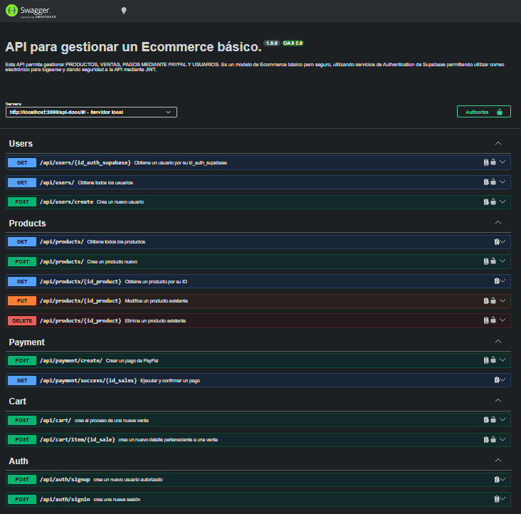
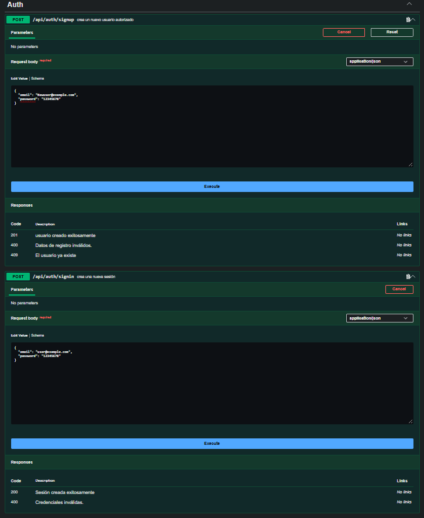
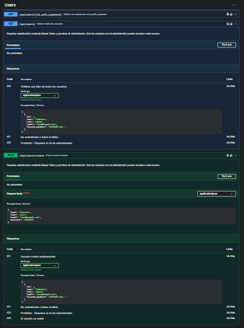
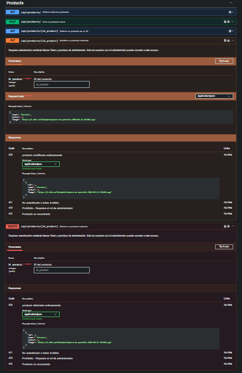
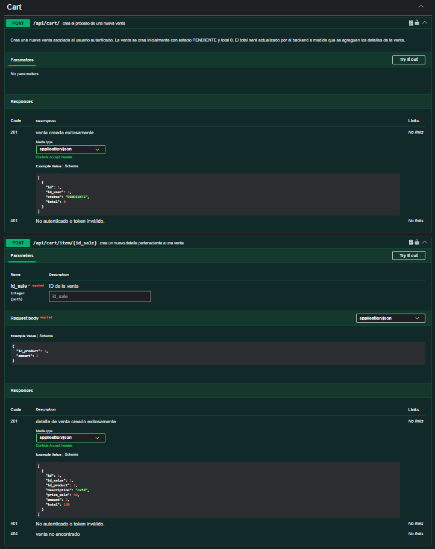
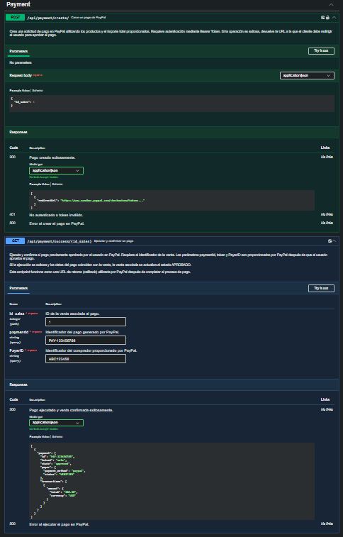

# Cart PayPal API

REST API desarrollada con Node.js y Express para la gestión de usuarios, productos, carritos, ventas y pagos mediante PayPal.

La API utiliza Supabase Auth para la autenticación de usuarios, PostgreSQL como sistema de persistencia de datos y PayPal Sandbox para la simulación de pagos.

El proyecto cuenta con autenticación mediante Bearer Token, autorización basada en roles, validación de datos, manejo centralizado de errores y documentación interactiva mediante Swagger.

---

### API en producción
La API se encuentra desplegada en Render y cuenta con documentación interactiva mediante Swagger.

<p align="center">
  <a href="https://cart-paypal-api.onrender.com/api-docs/#/">
    
  </a>
</p>

---

## Tecnologías utilizadas


<br>

**Backend:** Node.js · Express

**Database:** PostgreSQL · Supabase

**Authentication:** Supabase Auth

**Payments:** PayPal Sandbox

**Documentation:** Swagger / OpenAPI

**Validation:** express-validator

---

## Requisitos

- Node.js
- npm
- PostgreSQL
- Cuenta de Supabase
- Cuenta de PayPal Developer para utilizar PayPal Sandbox

---

## Instalación

Clonar el repositorio:
```bash
git clone <URL_DEL_REPOSITORIO>
```

Ingresar al directorio del proyecto:
```bash
cd cart-paypal
```

Instalar las dependencias:
```bash
npm install
```

VARIABLES DE ETORNO
Crear un archivo .env en la raíz del proyecto tomando como referencia .env.example
```env
PORT=3000

DB_USER=
DB_PASSWORD=
DB_HOST=
...
```
---

## Ejecución
Para ejecutar el servidor en modo desarrollo:
```bash
npm run dev
```
Por defecto, la API estará disponible en: http://localhost:3000

---

## Swagger
La API cuenta con documentación interactiva mediante Swagger UI.
Una vez iniciado el servidor, puede accederse a la documentación desde: http://localhost:3000/api-docs

---

## Configuración de Supabase

El proyecto utiliza Supabase Auth para gestionar el registro y autenticación de usuarios.

### 1. Crear un proyecto
Crear un proyecto desde el panel de Supabase.

### 2. Obtener las credenciales
Desde la configuración del proyecto, obtener:

- `SUPABASE_URL`
- `SUPABASE_ANON_KEY`

Estas variables deben agregarse al archivo `.env`.

```env
SUPABASE_URL=
SUPABASE_ANON_KEY=
SUPABASE_SERVICE_ROLE_KEY=
```

### 3. Configurar la base de datos

La API utiliza PostgreSQL para almacenar la información relacionada con:

- Usuarios
- Productos
- Ventas
- Detalles de ventas

El identificador generado por Supabase Auth se almacena en la base de datos como id_auth_supabase, permitiendo relacionar el usuario autenticado con su registro dentro de la aplicación.

---

## Configuración de PayPal Sandbox

El proyecto utiliza PayPal Sandbox para realizar pruebas de pago sin utilizar dinero real.
Si usted desea utilizarlo en modo Live debe cumplir con los requisitos de PayPal validando sus datos personales.

1. Crear una cuenta de desarrollador
Crear una cuenta en PayPal Developer y acceder al entorno Sandbox.

2. Crear una aplicación
Crear una aplicación dentro de las aplicaciones de Sandbox y obtener:

- Client ID
- Client Secret

Estas credenciales deben agregarse al archivo .env.
```env
PAYPAL_MODE=sandbox
PAYPAL_CLIENT_ID=
PAYPAL_CLIENT_SECRET=
PAYPAL_RETURN_URL=
PAYPAL_CANCEL_URL=
```

3. Utilizar una cuenta Sandbox
Para realizar las pruebas de pago se debe utilizar una cuenta de comprador Sandbox.

La API genera una URL de aprobación de PayPal que permite al usuario completar el proceso de pago.

## Autenticación
La autenticación de usuarios es gestionada mediante Supabase Auth.

El flujo principal de autenticación es:
Registro → Inicio de sesión → Bearer Token → Endpoints protegidos

### Registro
Para registrar un nuevo usuario: 
```http
POST /api/auth/signup
```
Ejemplo:
```JSON
{
    "email": "usuario@email.com",
    "password": "password123"
}
```
El registro crea las credenciales del usuario mediante Supabase Auth y posteriormente genera el registro correspondiente en la base de datos de la aplicación.

### Inicio de sesión
Para iniciar sesión:
```http
POST /api/auth/signin
```
Ejemplo:
```JSON
{
    "email": "usuario@email.com",
    "password": "password123"
}
```
La respuesta contiene la sesión y el token de acceso proporcionado por Supabase.

### Bearer Token
Los endpoints protegidos requieren enviar el token mediante el header:
```http
Authorization: Bearer <TOKEN>
```

### Autorización por roles
Algunos endpoints requieren además que el usuario autenticado posea el rol admin.

En estos casos se utilizan los middlewares de autenticación y autorización:
authenticate → isAdmin → controller

---

## Endpoints principales

### Auth

| Método | Endpoint | Descripción |
|---|---|---|
| POST | `/api/auth/signup` | Registrar usuario |
| POST | `/api/auth/signin` | Iniciar sesión |

### Users

| Método | Endpoint | Descripción |
|---|---|---|
| GET | `/api/users/:id_auth_supabase` | Obtener usuario |
| POST | `/api/users/create` | Crear usuario |

### Products

| Método | Endpoint | Descripción |
|---|---|---|
| GET | `/api/products` | Obtener productos |
| POST | `/api/products` | Crear producto |
| PUT | `/api/products/:id` | Modificar producto |
| DELETE | `/api/products/:id` | Eliminar producto |

### Cart

| Método | Endpoint | Descripción |
|---|---|---|
| POST | `/api/cart` | Crear una venta |
| POST | `/api/cart/item/:id_sale` | Agregar producto a la venta |

### Payments

| Método | Endpoint | Descripción |
|---|---|---|
| POST | `/api/payment/create` | Crear pago |
| GET | `/api/payment/success/:id_sales` | Ejecutar y confirmar pago |


Para consultar todos los endpoints, parámetros, esquemas de solicitud y respuesta, consultar la documentación interactiva de Swagger:
```http
https://cart-paypal-api.onrender.com/api-docs/#/
```

## Capturas de Swagger

La API cuenta con documentación interactiva mediante Swagger UI.

### Documentación general



### Autenticación



### Usuarios



### Productos



### Carrito y ventas



### Pagos


